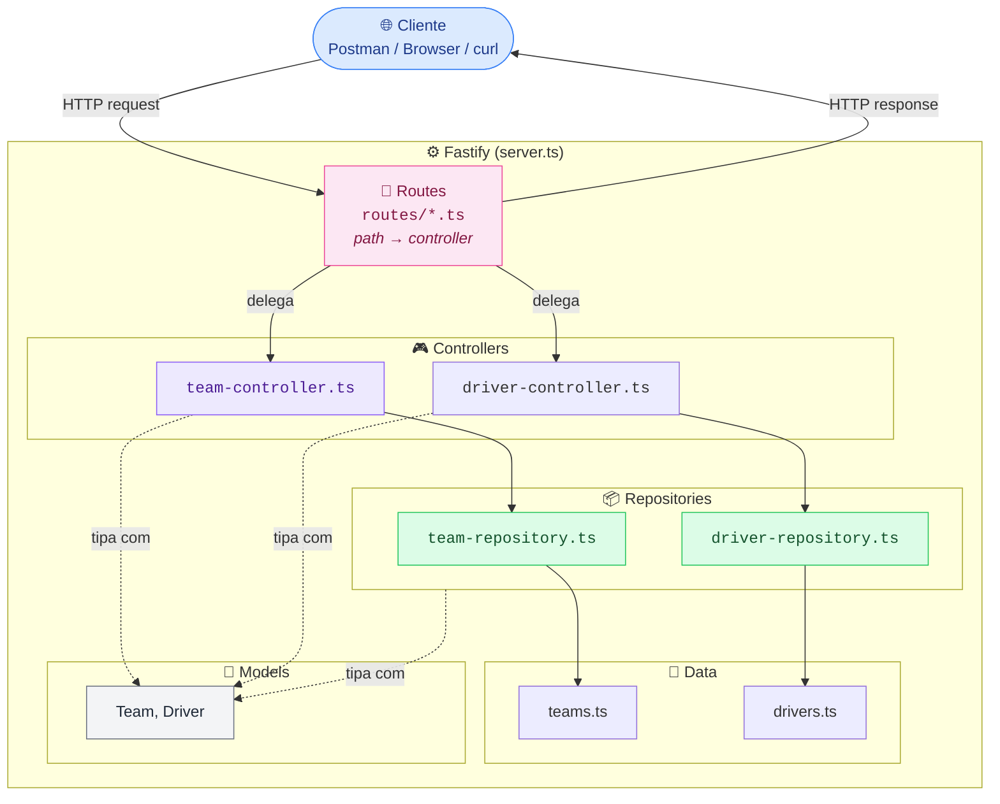

# 🏎️ Formula 1 API

API REST de dados da Fórmula 1 (equipes e pilotos), construída com **Node.js**, **TypeScript** e **Fastify**.

Em resumo: é uma API simples onde você consulta informações de equipes e pilotos da F1 (nome, base, equipe) através de requisições HTTP.

Este projeto foi desenvolvido para aplicar na prática os conhecimentos adquiridos no curso de Node.js da [**DIO.me**](https://www.dio.me/), colocando em uso conceitos como rotas, camadas de arquitetura, tipagem e build de uma API real.

## 🚀 Tecnologias

- [Node.js](https://nodejs.org/)
- [TypeScript](https://www.typescriptlang.org/) em modo `strict`
- [Fastify](https://fastify.dev/) como framework HTTP
- [@fastify/cors](https://github.com/fastify/fastify-cors) para liberar CORS
- [tsx](https://github.com/privatenumber/tsx) para execução direta de TypeScript em desenvolvimento
- [tsup](https://tsup.egoist.dev/) para build de produção (ESM)

## 🏗️ Arquitetura

A API é organizada em camadas, cada uma com uma única responsabilidade:



**Responsabilidade de cada camada:**

| Camada | Responsabilidade |
| - | - |
| **Routes** | Registra os paths no Fastify e delega para o controller correspondente. Não conhece regra de negócio. |
| **Controller** | Lê a requisição (params), valida entrada, chama o repository certo e monta a resposta HTTP (status code + JSON). |
| **Repository** | Busca os dados (hoje em memória). Isola a origem dos dados do resto da aplicação. |
| **Data** | Os dados em si (mockados em array). |
| **Models** | Define os contratos de tipo (`Team`, `Driver`) usados por todas as camadas acima. |

## 📦 Instalação

```bash
# Clone o repositório
git clone https://github.com/Renylson/formula1-api-nodejs-fastify.git

# Acesse a pasta do projeto
cd formula1-api-nodejs-fastify

# Instale as dependências
npm install

# Copie o arquivo de variáveis de ambiente
cp .env.example .env
```

## ▶️ Como rodar

```bash
# Modo desenvolvimento
npm run start:dev

# Modo desenvolvimento com reinício automático
npm run start:watch

# Build + execução em produção
npm run start:dist
```

O servidor sobe em `http://localhost:8080` por padrão (configurável via `.env`, veja `.env.example`).

## 📖 Modelo de dados

```ts
interface Team {
  id: number;
  name: string;
  base: string;
}

interface Driver {
  id: number;
  name: string;
  team: string;
}
```

## 🔌 Endpoints

### Listar equipes

```text
GET /teams
```

**Resposta `200 OK`:**

```json
{
  "teams": [
    { "id": 1, "name": "Mercedes", "base": "Brackley, Reino Unido" }
  ]
}
```

---

### Buscar equipe por id

```text
GET /teams/:id
```

**Resposta `200 OK`:**

```json
{ "id": 1, "name": "Mercedes", "base": "Brackley, Reino Unido" }
```

**`400 Bad Request`** se o `id` não for numérico. **`404 Not Found`** se o `id` não existir.

---

### Listar pilotos

```text
GET /drivers
```

**Resposta `200 OK`:**

```json
{
  "drivers": [
    { "id": 1, "name": "Lewis Hamilton", "team": "Mercedes" }
  ]
}
```

---

### Buscar piloto por id

```text
GET /drivers/:id
```

**Resposta `200 OK`:**

```json
{ "id": 1, "name": "Lewis Hamilton", "team": "Mercedes" }
```

**`400 Bad Request`** se o `id` não for numérico. **`404 Not Found`** se o `id` não existir.

## ⚠️ Tratamento de erros

| Status | Quando acontece |
| - | - |
| 400 | `id` informado não é um número válido |
| 404 | Equipe ou piloto com o `id` informado não encontrado |

## 📂 Estrutura do projeto

```text
formula1-api-nodejs-fastify/
├── src/
│   ├── server.ts
│   ├── routes/
│   │   ├── team-routes.ts
│   │   └── driver-routes.ts
│   ├── controllers/
│   │   ├── team-controller.ts
│   │   └── driver-controller.ts
│   ├── repositories/
│   │   ├── team-repository.ts
│   │   └── driver-repository.ts
│   ├── data/
│   │   ├── teams.ts
│   │   └── drivers.ts
│   └── models/
│       ├── team-models.ts
│       └── driver-models.ts
├── .env.example
├── tsconfig.json
├── tsup.config.ts
├── package.json
└── README.md
```

## 🙏 Agradecimentos

Este projeto foi construído aplicando os conhecimentos adquiridos através do curso da [**DIO.me**](https://www.dio.me/), ministrado por [**Felipe Silva Aguiar**](https://github.com/felipeAguiarCode).

## 📄 Licença

Este projeto está sob a licença MIT.
